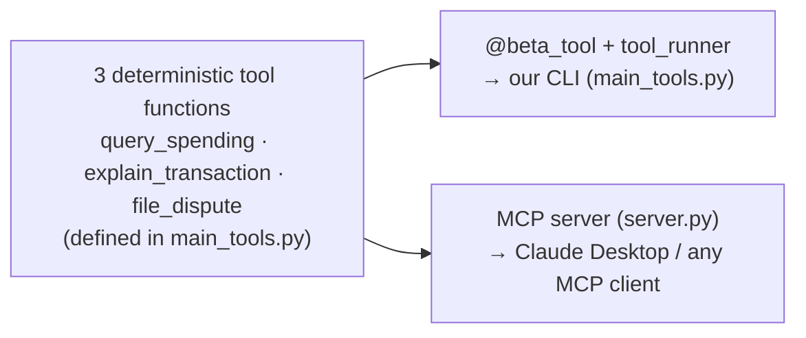
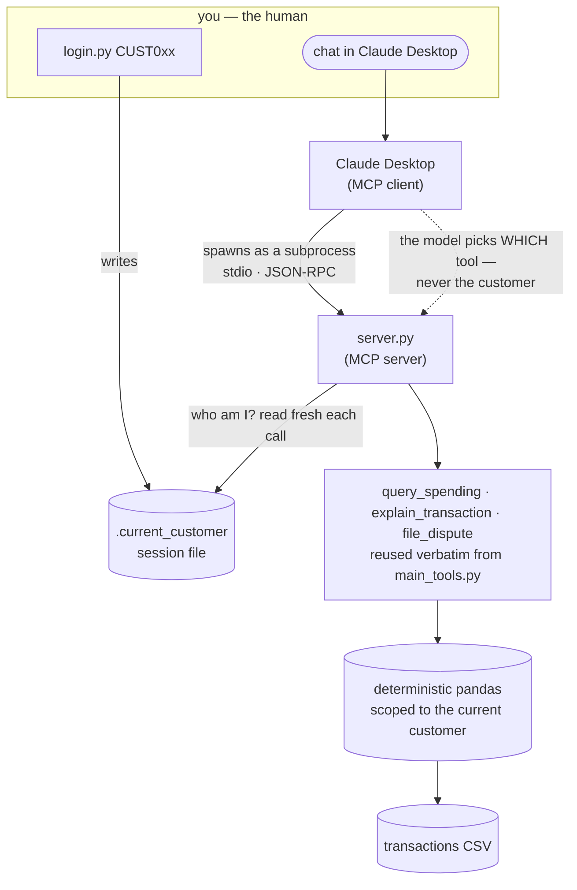

# MCP server — same tools, any client

MCP is **how you deliver the model-orchestrates philosophy** — it takes the tools
from `LLM_BOT/main_tools.py` and serves them over a protocol so any client can use
them.

[`server.py`](server.py) exposes the **exact same three tools** as
`LLM_BOT/main_tools.py` — `query_spending`, `explain_transaction`,
`file_dispute` — but over the **Model Context Protocol**. So instead of only our
CLI being able to call them, **any MCP client** can: Claude Desktop, Claude Code,
Cursor, another agent. The tool *bodies are reused verbatim* from `main_tools`
(via `main_tools.query_spending.func`, etc.); only the delivery changes.

> **The whole lesson: same code, different client.** Tool calling let the model
> pick our functions inside one script. MCP turns those same functions into a
> **standalone service** that many clients can share.

*One set of functions, two delivery mechanisms:*



## What MCP adds over `main_tools.py`

- **Reuse / interoperability** — the tools are no longer trapped in one script;
  any MCP-capable app can use them.
- **A real boundary** — the server is a separate process speaking a protocol
  (JSON-RPC over stdio), not a Python import.
- **Stronger isolation & a credential boundary** — the server is "logged in" as
  **one customer** (`BANK_CUSTOMER_ID`), like an authenticated session.
  `customer_id` is not a tool argument, so the connecting model can only ever
  query that customer. In a real deployment the server would also hold the
  database credentials — the model would never see raw data or secrets, only the
  computed result.

## Run it (stdio)

```bash
cd MCP_BOT
pip install -r requirements.txt
BANK_CUSTOMER_ID=CUST031 python server.py     # serves over stdio; Ctrl+C to stop
```

On its own it just waits for an MCP client to connect over stdio — you point a
client at it (below).

## Choosing who you are (switch customer, no restart)

The server is "logged in" as one customer, but **you** can switch — the model
can't. Identity is read fresh on every tool call, in order: a `.current_customer`
session file → the `BANK_CUSTOMER_ID` env var → a default.

```bash
python login.py           # show who you are now
python login.py CUST001   # become CUST001 — takes effect on your next question
```

`login.py` just writes the session file; the running server picks it up on the
next call, so **no restart of Claude Desktop is needed**. Because the model can't
run `login.py` or pass a `customer_id`, it can never change who you are — the
isolation guarantee stays intact while *you* get to choose (like logging in).

## Point Claude Desktop at it

Edit Claude Desktop's config (macOS:
`~/Library/Application Support/Claude/claude_desktop_config.json`) and add — using
**absolute paths**:

```json
{
  "mcpServers": {
    "banking-transactions": {
      "command": "/Volumes/PoweredByZeus/Python_2026/Trifork/env/bin/python",
      "args": ["/Volumes/PoweredByZeus/Python_2026/Trifork/project_2/MCP_BOT/server.py"],
      "env": { "BANK_CUSTOMER_ID": "CUST031" }
    }
  }
}
```

Restart Claude Desktop. The three tools appear under the tools (🔌) menu, and you
can ask Claude Desktop *"how much did I spend on groceries in 2025?"* — it calls
your `query_spending` tool and gets the exact pandas figure. **The same functions
you tested in the CLI now answer a completely different app**, with no change to
their code.

> Prefer not to touch Claude Desktop? The MCP Inspector
> (`npx @modelcontextprotocol/inspector /path/to/env/bin/python server.py`) is a
> browser UI for poking at the server directly — it needs Node/`npx`.

## How it fits together



Reading it: **you** set identity (`login.py` → the session file); **Claude
Desktop** spawns the server over stdio and its model chooses *which* tool to call;
the **server** reads your identity fresh on every call and runs the *same*
deterministic pandas as the CLI. The model can pick the tool, but not the
customer — and in production the server would also hold the DB credentials, so
raw data and secrets never reach the model.

## The bigger picture

Because the tools stay **deterministic Python**, everything this project argued
holds all the way through: the model chooses *which* tool, but Python still owns
the numbers, the rules, and customer isolation. MCP just makes those tools a
reusable, independently-deployable capability — and sets you up to **compose**
them with other MCP servers (mail, calendar, …) in a single client.