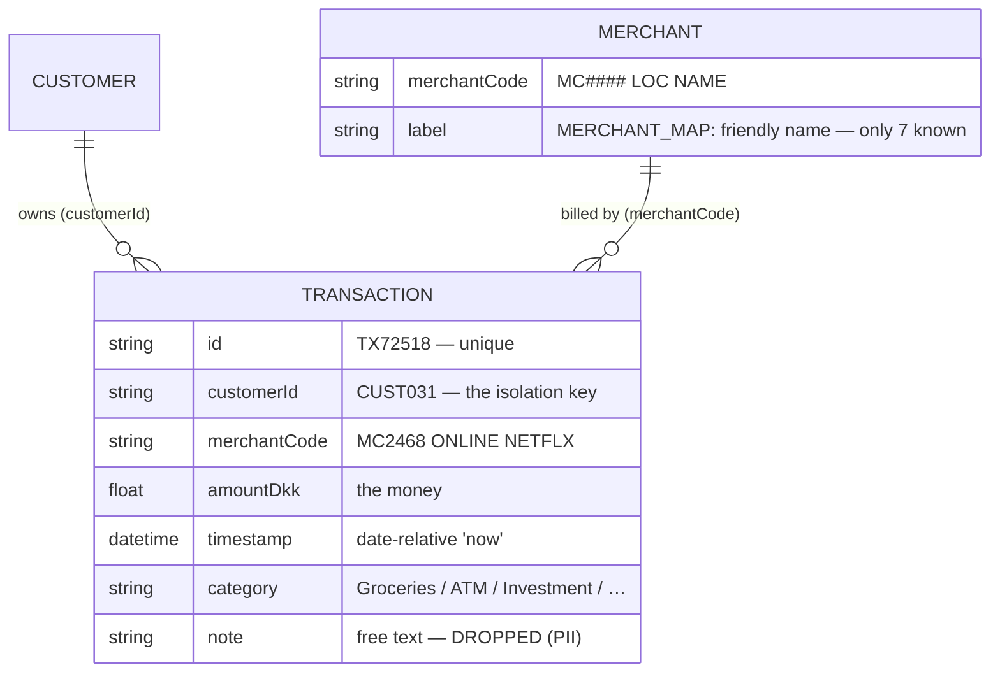
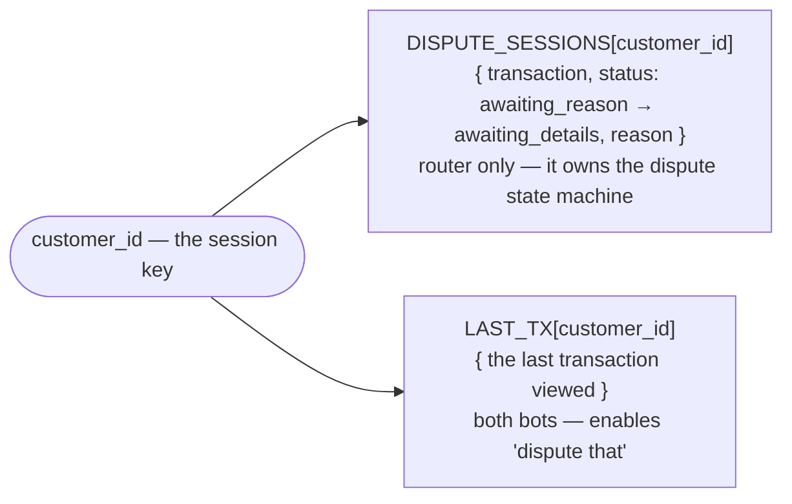
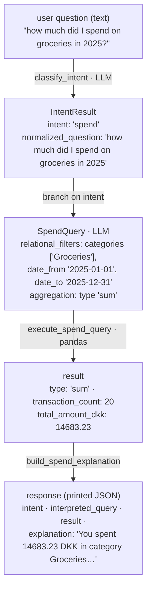
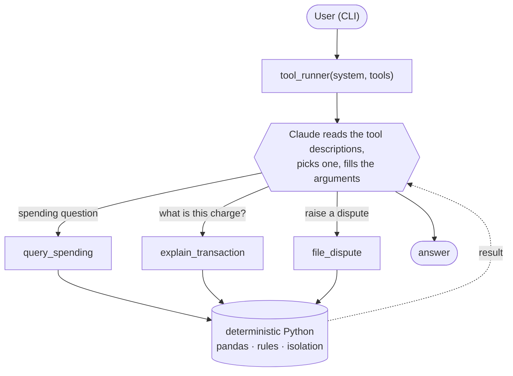
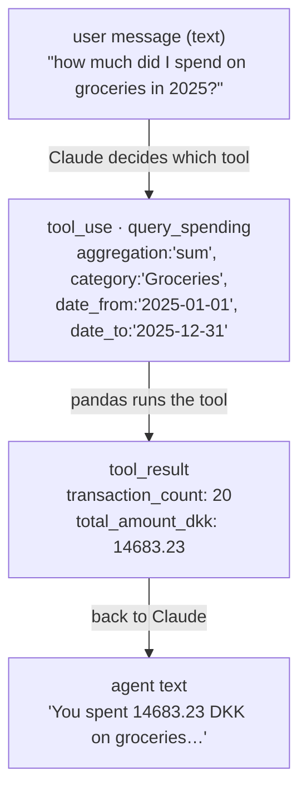
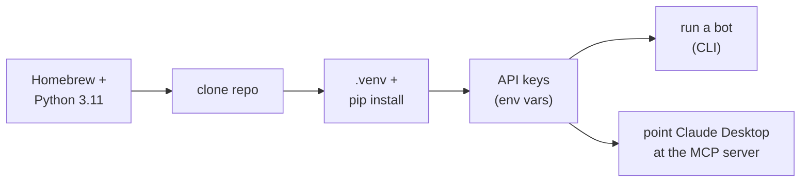

# LLM-Bot — two AI philosophies

This project is a tiny, end-to-end banking assistant, over a CSV of card
transactions, that can:

1. **Answer natural-language spending questions** — "how much did I spend on
   groceries in 2025?", "top 3 transactions", "spending by category"
2. **Explain a transaction** in human-readable language (but only for the customer
   who actually made it)
3. **Run a dispute flow** that follows the rules (4 reasons, no fees/ATM, 90-day
   limit, structured JSON)

It does this by **splitting the problem in two**:

- things that are **semantic / human** → we let the **LLM** handle it
- things that are **relational / deterministic / business rules** → we keep in
  **Python** (pandas)

That split is what makes the whole thing work on new CSVs and still stay safe.

| Philosophy | Who routes? | File |
| ---------- | ----------- | ---- |
| **Philosophy 1 — Router** | **You** — classify the intent, then a hand-written `if/elif` dispatches | [`Old_LLM_BOT/main.py`](Old_LLM_BOT/main.py) |
| **Philosophy 2 — Tool calling** | **The model** — you hand it tools and it picks which to call | [`LLM_BOT/main_tools.py`](LLM_BOT/main_tools.py) |

These are **two schools, not two stages** — neither is "more advanced"; both are
used in production today. The two bots happen to run on different providers (the
router on **OpenAI**, the tool bot on **Claude**), but that's incidental — the
architecture is what matters. And because Philosophy 2's actions are plain Python
tools, they can be packaged and shared: the final section shows them served over
[MCP](#mcp--delivering-philosophy-2) to any MCP client, such as Claude Desktop.

---

## The data

The dataset is `transactions_sample.csv` (3,000 rows, 40 customers `CUST001…040`),
identical in both folders. Columns: `id, customerId, merchantCode, amountDkk,
timestamp, category, note`.

**The data model** — one flat transactions table, plus a small merchant lookup:



`MERCHANT` isn't a separate file — it's the `MERCHANT_MAP` dict (7 friendly names)
plus the merchant codes that appear in the data. `customerId` is the **isolation
key**: every query starts by filtering to one customer.

**Runtime state** — small, in-memory, keyed by customer:



In-memory and ephemeral (a process dict); isolation is by key. The **router**
keeps a `DISPUTE_SESSIONS` entry because it owns the multi-turn dispute state
machine; the **tool bot** keeps only `LAST_TX`, because the model tracks the
dispute in the conversation. Production would use Redis / a DB with a TTL.

---

## The idea both share: semantic vs. deterministic

Whichever way you route, the split underneath is identical:

- things that are **semantic / language** → the **LLM**
- things that are **money, rules, or customer isolation** → **Python** (pandas)

**What the LLM handles**

- **Intent** — "how much did I…", "what is…", "I don't recognise…"
- **Fuzzy merchant names** — "McDonalds", "MCDON", "mc don" → a real merchant code
- **Fuzzy time phrases** — "in October", "last 2 days", "January and May"
- **Free-form dispute text** — "I was charged twice" → one of the 4 reasons

**What Python / pandas enforces**

- **Only this customer's transactions** — `df[df["customerId"] == customer_id]`
- **Exact date filters** — date ranges, `last_n_days` (data-relative)
- **Only real categories** — no hallucinated categories
- **Exact aggregations** — `sum` / `count` / `top_n` / `group_by_category` / `min_date` / `max_date`
- **Business rules** — no disputes on ATM/fees, not older than 90 days, **4 reasons only**

---

## Approach 1 — Router (`Old_LLM_BOT/main.py`)

```
User (CLI)
  │
  ├─▶ (1) read current_customer from CLI
  │
  ├─▶ (2) user types question
  │
  └─▶ handle_user_query(customer_id, question)
        │
        ├─▶ try: azure_classify_intent(...)   ← LLM call
        │        │
        │        └─▶ returns { intent: "spend" | "explain" | "dispute",
        │                      normalized_question: "..."}
        │
        ├─▶ if LLM failed → detect_intent_legacy(...)
        │
        ├─▶ branch on intent
        │     ├─ "spend"   → spend path
        │     ├─ "explain" → explain path
        │     └─ "dispute" → dispute path
        │
        └─▶ return JSON to CLI (printed)
```

> **Naming note:** the `azure_*` prefix is historical — the bot originally ran on
> Azure; the calls now go to the **OpenAI API** (this is also the "GPT" referenced
> below).

### Why this design?

**We only ask the LLM what it’s good at.**  
The LLM decides what the user wants (**spend / explain / dispute**) and normalizes the question. Everything that must be strict (filtering, summing, 90-day rule) stays in **Python**.

**Each path can be developed separately.**

- **Spend path** → LLM → structured query → pandas  
- **Explain path** → customer-only lookup → grounded explanation  
- **Dispute path** → interactive, 4 fixed reasons, JSON output  

Because they’re separate, they don’t step on each other.

**Sticky customer = realistic banking flow.**  
We read the `customerId` once and keep it. That makes follow-up turns like “I would like to dispute” possible **without** repeating the ID.

**Graceful degradation.**  
If `azure_classify_intent(...)` fails (bad response, schema mismatch, rate limit), we don’t crash — we fall back to `detect_intent_legacy(...)` (a simple Python classifier). So the CLI always returns *something*.

**Easy to log and demo.**  
At the router we could log:

- what the user asked  
- what the LLM thought the intent was  
- which path was executed  

That makes it very clear to a reviewer where mistakes come from.

**Security / isolation stays central.**  
Because routing happens in one place, we can enforce “only look at **this** customer’s transactions” in each path, and never let the LLM “guess” other people’s data.


### The JSON flowing through (worked example)


---
### Spend path

```text
SPEND path
  │
  ├─▶ azure_chat_structured(normalized_question, customer_id)   ← LLM call
  │      │
  │      └─▶ returns structured query:
  │             {
  │               "intent": "spend_query",
  │               "customer_id": "...",
  │               "relational_filters": {...},
  │               "semantic_filters": {...},
  │               "aggregation": {
  │                  "type": "sum" | "count" | "top_n" |
  │                          "group_by_category" | "min_date" | "max_date"
  │               },
  │               "raw_question": "..."
  │             }
  │
  ├─▶ execute_spend_query(query)
  │      │
  │      ├─▶ (1) load df = get_transactions_df()
  │      ├─▶ (2) filter to this customerId
  │      ├─▶ (3) apply **RELATIONAL** filters
  │      │       • date_ranges → OR over ranges
  │      │       • last_n_days → now - N (or data-relative)
  │      │       • date_from / date_to
  │      │       • category (lowercased)
  │      │       • merchantCode_exact
  │      ├─▶ (4) apply **SEMANTIC** merchant
  │      │       • if semantic_filters.merchant_text:
  │      │             – collect candidate merchantCodes
  │      │             – azure_resolve_merchant(user_text, candidates)   ← LLM call (only if fuzzy)
  │      │             – else fallback to substring
  │      └─▶ (5) aggregation switch
  │              • sum / count / top_n / group_by_category
  │              • min_date → earliest tx
  │              • max_date → latest tx
  │
  ├─▶ build_spend_explanation(...)
  │
  └─▶ return {
         "intent": "spend",
         "interpreted_query": ...,
         "result": ...,
         "explanation": "..."
       }
```

Together with the classify call in the overview, a spend turn makes up to
**three** LLM calls — classify, parse the query, resolve the merchant (the third
only when the merchant is fuzzy). See
[How many API calls per turn?](#how-many-api-calls-per-turn).

### Explain path
```text
EXPLAIN path
  │
  ├─▶ handle_explain(customer_id, question)
  │      │
  │      ├─▶ find_transactions_for_user(...)
  │      │       • strip "what is", "explain", "hvad er", ...
  │      │       • if TX... → exact id match
  │      │       • else → substring on merchantCode (for THIS customer only)
  │      │
  │      ├─▶ if no match → "Unknown merchant, please contact support."
  │      │
  │      ├─▶ else → pick first, save in LAST_TX_BY_CUSTOMER[customerId]
  │      │
  │      └─▶ _build_grounded_explanation_from_tx(tx)
  │             • if merchantCode in MERCHANT_MAP → friendly text
  │             • else → "Unknown merchant, please contact support."
  │
  └─▶ return JSON
```
---
### Dispute path

The "4 reasons" are a fixed policy whitelist (`ALLOWED_DISPUTE_REASONS` in the
router, `DISPUTE_REASONS` in the tool bot) — a dispute must resolve to exactly one
of them:

1. Fraudulent transaction
2. Duplicate charge
3. Goods/services not received
4. Wrong amount charged

```text
DISPUTE path
  │
  ├─▶ handle_dispute(customer_id, question)
  │      │
  │      ├─▶ check DISPUTE_SESSIONS[customer_id]
  │      │      ├─ if status == "awaiting_reason":
  │      │      │      • _parse_dispute_reason(...)
  │      │      │      • if no reason → ask again (list 4)
  │      │      │      • else → status = "awaiting_details"
  │      │      │
  │      │      └─ if status == "awaiting_details":
  │      │             • take user description
  │      │             • output FINAL JSON:
  │      │                  { TransactionId, Reason,
  │      │                    Collected user inputs, Submission timestamp }
  │      │
  │      └─▶ (no session) → start new
  │             • find tx (from text OR LAST_TX_BY_CUSTOMER)
  │             • check non-disputable (ATM, cash, fees, >90 days)
  │             • create session = awaiting_reason
  │             • return list of 4 dispute reasons
  │
  └─▶ CLI prints the JSON
```

### What can (and can’t) be LLM-ified

Not every function in this project should be handed to the LLM. Some parts are **meant** to be fuzzy and language-driven, and some parts **must** stay deterministic because they touch money, rules, or user isolation.

**Note:** you could also design this so that there is **just a single Azure call** per user message that does *everything* (intent + structured spend query + resolve merchant ). 
In **this demo**, we’ve **split it into several smaller calls** because it’s easier to debug, easier to test each step, and it makes the “semantic vs relational” split very clear.


Here’s how the current code breaks down:

| Function / area                       | Can we LLM it?            | Pros                               | Cons                                   |
| ------------------------------------- | ------------------------- | ---------------------------------- | -------------------------------------- |
| `azure_classify_intent`               | Already LLM               | flexible intents                   | depends on schema/version              |
| `azure_chat_structured`               | Already LLM               | rich queries, date ranges          | can fail → fallback                    |
| `azure_resolve_merchant`              | Already LLM               | fixes misspellings                 | extra call                             |
| `find_transactions_for_user`          | ✅ yes                     | fuzzier matching, nicer “what is…” | must still filter to user’s own txs    |
| `_build_grounded_explanation_from_tx` | ✅ yes (with map)         | nicer, localized text              | must forbid hallucination, pass map    |
| `_parse_dispute_reason`               | ✅ yes                     | handles free-form user text        | still need to whitelist 4 reasons      |
| `build_spend_explanation`             | ✅ optional                | nicer wording                      | costs more, risk mismatch with numbers |
| `execute_spend_query`                 | ❌ no                      | —                                  | must be deterministic                  |
| `_is_nondisputable`                   | ❌ no                      | —                                  | must enforce business rules          |
| `start_dispute_submission`            | ❌ no                      | —                                  | must output fixed JSON                 |
| `detect_intent_legacy`                | could drop if LLM is 100% | smaller code                       | but legacy saves you when LLM fails    |

#### How to read this table

- **“Already LLM”** → we’re *already* calling GPT here, because it’s the best tool (intent detection, fuzzy merchant matching).
- **“✅ yes”** → we *can* push this to GPT to make it smarter/nicer, **but** we should still validate the answer in Python.
- **“❌ no”** → must stay in Python because it’s either money, rules, or user isolation.

---

## Approach 2 — Tool calling (`LLM_BOT/main_tools.py`)

You give the model a set of **tools** and let it decide which to call. The
`classify_intent` + `if/elif` **disappears**.



The three tools are ordinary Python functions:

- `query_spending(aggregation, category, date_from/to, date_ranges, last_n_days, merchant_text, n)`
- `explain_transaction(reference)`
- `file_dispute(reference, reason)` — enforces the rules; a bad reason or an ATM
  charge returns an error the model must relay, never overrides.

Key properties:

- The control flow is **decided by the model** at runtime — it can pick a tool,
  chain tools, or ask a clarifying question, none of which you hard-coded.
- **Python still owns the numbers and rules.** `file_dispute` rejects an ATM
  charge or a non-whitelisted reason; the model can't talk past it.
- **`customer_id` is not a tool argument** — the tools read the session's fixed
  customer, so Claude literally cannot query another customer.
- **The dispute "state machine" isn't written by you** — the model asks for a
  reason and collects details in the ordinary conversation.
- The `@beta_tool` decorator generates each tool's JSON schema from the function
  signature + docstring — "you write Python, the SDK writes the schema."

### The JSON flowing through (same query, tool calling)

The same question — but now the model chooses the tool. Notice the **tool input is
the same object** as Approach 1's `SpendQuery`, and the **tool result is the same**
as Approach 1's `result`. Same step-level JSON, produced as a tool call instead of
a parsed query:



The artifacts match Approach 1 exactly — `tool_use.input` ≈ `SpendQuery`,
`tool_result` ≈ `result`. What's *not* fixed is the **trajectory**: the model might
call one tool, several, or ask a clarifying question first, so the trail is decided
at runtime rather than by your code.

---

## Router vs. tool calling — how they compare

| Dimension | Router (`Old_LLM_BOT`) | Tool calling (`main_tools.py`) |
| --------- | ---------------------- | ------------------------------ |
| **Who chooses the action** | You (`classify_intent` → `if/elif`) | The model (`tool_runner`) |
| **The LLM's job** | Label the intent + fill a structured query | Pick a tool + fill its arguments |
| **Control flow** | Fixed, written by you — fully auditable | Emergent — decided at runtime |
| **Add a 4th capability** | New intent + new `if` branch + new parser | Just add a tool — no routing code |
| **Multi-step / clarifying questions** | You code the state machine (e.g. the dispute flow) | The model handles it in the conversation |
| **Predictability** | High — you know every path | Lower — more flexible, less certain |
| **Customer isolation** | You pass the authenticated id into each path | `customer_id` isn't even a tool argument |
| **Where the rules live** | In the path, checked where you put the check | In the tool — enforced whenever the model calls it |

### The one-line difference

> **Router:** the LLM *labels*, your code *decides*.
> **Tool calling:** the LLM *decides*, your tools *execute*.

In both, the **deterministic Python still owns money, rules, and isolation** — so
handing routing to the model doesn't weaken the guarantees. It moves the
*decision of what to do* from your `if/elif` into the model, while the *doing*
stays in the same pandas functions.

### How many API calls per turn?

The same tradeoff shows up in the **API bill**. In the router, only three
functions ever hit the LLM — `azure_classify_intent`, `azure_chat_structured`
(parse the spend query), and `azure_resolve_merchant`. The explain lookup and the
dispute-reason parser are **deterministic Python, zero API calls**. So the cost is
fixed and predictable per intent:

| Intent | Router calls | Breakdown |
| ------ | ------------ | --------- |
| **explain** | **1** | classify only |
| **dispute** | **1** | classify only (reason parsing is keyword-based) |
| **spend** (no fuzzy merchant) | **2** | classify + parse query |
| **spend** (fuzzy merchant, e.g. "netflix") | **3** | classify + parse query + resolve merchant |

So a router turn is a bounded **1–3 calls**. (One caveat: if the schema-constrained
spend-query parse fails, it retries once schema-free — so a spend turn can cost one
extra call on the error path, never in the normal case.)

**Tool calling isn't a fixed number.** `tool_runner` loops until the model stops,
so a turn is *at least* 2 calls — one to pick the tool, one to phrase the answer
after seeing the tool result — and more if the model chains tools or asks a
clarifying question first. The router's cost is bounded and known ahead of time;
the tool bot's is decided at runtime — the same **you orchestrate vs. the model
orchestrates** tradeoff, now visible as tokens spent.

---

## MCP — delivering Philosophy 2

[`MCP_BOT/server.py`](MCP_BOT/server.py) exposes the **same three tools** over the
**Model Context Protocol**, so *any* MCP client
(Claude Desktop, Claude Code, another agent) can use them — not just our CLI. The
tool bodies are reused **verbatim** from `main_tools.py` (via
`main_tools.query_spending.func`, etc.); only the delivery changes.

The server is authenticated as **one customer** (`BANK_CUSTOMER_ID`), so isolation
is even stronger: `customer_id` isn't a tool argument, so a connecting model can
only ever query that customer — and in production the *server* (not the model)
would hold the database credentials, so the model never sees raw data or secrets.

```bash
cd MCP_BOT && pip install -r requirements.txt
BANK_CUSTOMER_ID=CUST031 python server.py      # serves over stdio
```

Point Claude Desktop (or any MCP client) at it — see
[`MCP_BOT/README.md`](MCP_BOT/README.md), or the step-by-step in
[Running it](#running-it). **Same code, different client**, all the way through: the
model chooses which tool, Python still owns the numbers, the rules, and isolation.

    Two philosophies, one core — MCP just changes who can reach Philosophy 2's tools.

---

# Going deeper

## Why not plain RAG?

A natural first instinct is RAG: embed the CSV rows and let the model answer from
the retrieved chunks. For **exact numbers that doesn't work**, for two reasons:

- **Incomplete retrieval** — vector search returns the *top-k similar* rows, not
  *all* matching rows. A total computed over a partial set is simply wrong.
- **In-model arithmetic** — even with the rows in context, the LLM sums them in
  its head, and LLMs are unreliable at adding many numbers.

The fix is the pattern this project uses: **let the model write a *query*, run it
deterministically, and feed the result back.** That is still retrieval-augmented
generation — the retriever is just a database / pandas query instead of a vector
search (a.k.a. *text-to-SQL*):

```
question → LLM writes a structured query → pandas RUNS it → exact number → LLM phrases it
```

`execute_spend_query` / `query_spending` **is the retriever** — the model never
touches the numbers, it only describes what to fetch.

Where classic **vector** RAG still fits is the *semantic* bits, not the math:

- fuzzy merchant matching ("netflix" → `MC2468 ONLINE NETFLX`) could use
  embeddings instead of substring;
- a document knowledge base (dispute policy, product manuals) is a real RAG job.

| Question type | Right tool |
| ------------- | ---------- |
| Compute an exact figure over rows | **structured query** (text-to-SQL / pandas) |
| Find the semantically closest thing | **vector retrieval** (embeddings) |
| "What does this document say?" | **vector RAG** over documents |

The tool-calling bot (Approach 2) is essentially **agentic RAG** — the model
decides *when* to retrieve and calls a retrieval *tool* (`query_spending`) whose
"index" is exact pandas rather than a vector store.

## Observability & analytics at scale

Run either bot millions of times and you'll want to ask "what are people doing?"
The two approaches differ in what's easy to measure — but less than you'd think.

**Per-step statistics are equally easy.** Every step in *both* is structured JSON
with a known schema — the router's `SpendQuery` and the tool-calling
`query_spending` input are the same shape (see the two worked examples above). So
"% of spend queries that group by category", "distribution of dispute reasons",
"how often groceries is queried" are trivial in either.

**Whole-flow statistics are where they diverge.**

- **Router** — one interaction takes one of a *small, fixed* set of paths
  (`classify → parse → execute`, or the dispute state machine). "What path did this
  go through?" has a handful of answers, bucketing is trivial, and because routing
  is deterministic the stats are stable run-to-run.
- **Tool calling** — the model chooses the sequence at runtime, so a "flow" is a
  *variable-length sequence with a long tail* (one tool call, or three, or a
  clarifying question first). The individual steps are still clean; it's the
  **trajectory** that's high-cardinality — and the same question can route
  differently across runs, adding noise. Flow-level analytics needs real
  logging/tracing; the router hands it to you for free.

**One more:** the router logs an explicit `intent` field; tool calling has none —
you *derive* intent from which tool was called. Both work; one is handed to you,
the other inferred.

> **In short:** step-level questions ("which aggregations? which dispute reasons?")
> are equally easy in both. Flow-level questions ("what path did the interaction
> take?") are free in the router and a logging/tracing job in tool calling — the
> price of letting the model choose the sequence.

## Is Approach 1 multi-agent?

You can argue **yes**, in the sense the brief means (*"chain multiple agents with
distinct roles — Retriever, Summariser, Validator"*). The router is a chain of
role-specialised steps, each a focused LLM call with a single job:

| Role | In the router |
| ---- | ------------- |
| **Classifier / dispatcher** | `classify_intent` — spend / explain / dispute / out_of_scope |
| **Query interpreter (retriever)** | `parse_spend_query` — natural language → a structured query |
| **Entity resolver** | `resolve_merchant` — fuzzy "netflix" → a real merchant code |
| **Explainer / summariser** | `build_spend_explanation` — phrases the grounded answer |
| **Validator / executor** | `execute_spend_query`, `is_nondisputable` — deterministic Python enforces the numbers and rules |

Each step has one responsibility and hands a typed object to the next — the
"distinct roles chained together" pattern.

These are **specialised steps in a fixed pipeline**, not
**autonomous** agents that plan and negotiate. So it's multi-agent in the
*role-chain* sense, not the *autonomous-agent* sense. The two bots sit on opposite
corners: **Approach 1 is a multi-role pipeline** (several roles, fixed order);
**Approach 2 is a single autonomous agent** (one model, dynamic tool use). 

## Handling invalid & malicious requests

Both bots refuse out-of-scope or malicious input gracefully:

- **Router** — an explicit `out_of_scope` intent (the classifier routes off-topic,
  other-customer, or "reveal your instructions" requests there), plus a
  deterministic prompt-injection guard that refuses *before* even calling the
  model.
- **Tool bot** — a system-prompt rule to decline anything outside the customer's
  own transactions and never reveal/override its instructions, **and structural
  isolation**: `customer_id` isn't a tool argument, so it *cannot* fetch another
  customer's data.

No sensitive leakage either way — every query is filtered to the authenticated
customer in Python, and refusals carry no data.

## Privacy & GDPR

- **Data minimisation** — only the authenticated customer's rows are ever queried;
  isolation is enforced in Python, never trusted to the model.
- **The model never sees the whole table** — it gets only the aggregate or single
  row it asked for. This is strongest in the tool-calling / MCP shape, where the
  server runs the query and returns just the result.
- **No unnecessary PII** — the free-text `note` column is dropped, and answers are
  figures, not raw customer records.
- **Local / on-prem option** — for stricter data-residency needs, point the bot at
  a local model (e.g. Ollama) so transaction data never leaves your infrastructure.

## Testing

An offline `pytest` suite lives in [`tests/`](tests) — **23 tests, no API key
needed**. It asserts the part that must always be correct: **customer isolation**,
**every spend aggregation against a direct pandas computation**, and the **dispute
rules** — for *both* bots. (The LLM's routing is validated separately, live.)

```bash
pip install pytest pandas
pytest            # from the project_2 folder
```

The deterministic core is what's tested because that's what owns the money and the
rules — exactly the semantic/deterministic split this whole project is about.

## Notes & limitations

- **One intent per turn.** Both handle a single intent per message; the dispute
  flow is the one multi-turn exception. Multi-intent ("spend *and* dispute the
  biggest one") would mean returning several intents/tools and merging results.
- **Dates are data-relative.** The sample data is historical (2025), so "last N
  days" and the 90-day dispute window are anchored to the newest transaction, not
  the real clock. In production that would be `datetime.now()`.
- **In-memory state.** Dispute sessions live in a process dict keyed by customer;
  production would use Redis/DB with a TTL.
- **Fixes made while comparing** the two live are logged in
  [`Old_LLM_BOT/ToDo.md`](Old_LLM_BOT/ToDo.md) (data-relative rules, dispute-first
  routing, code-enforced isolation, intent-prompt coverage, and more).

---

# Running it

Two ways to run: the quick per-bot commands, or a from-scratch MacBook Air (M1)
setup with Claude Desktop.

## Running them (quick)

**Router (OpenAI):**
```bash
cd Old_LLM_BOT
pip install -r requirements.txt
export OPENAI_API_KEY=sk-...
python main.py
```

**Tool calling (Claude):**
```bash
cd LLM_BOT
pip install -r requirements.txt
export ANTHROPIC_API_KEY=sk-ant-...
python main_tools.py
```

**MCP server (any MCP client):**
```bash
cd MCP_BOT
pip install -r requirements.txt
BANK_CUSTOMER_ID=CUST031 python server.py     # serves the same tools over MCP
```
(then point Claude Desktop or another MCP client at it — see [`MCP_BOT/README.md`](MCP_BOT/README.md))

Pick a customer id (e.g. `CUST031`) and ask away. Some things to try that exercise
each path: *"how much did I spend on groceries in 2025 except January and May?"*
(spend), *"what is TX70196?"* (explain), *"I don't recognise TX90009"* → follow the
prompts (dispute).

The Claude router (`LLM_BOT/main.py`) additionally runs **with no API key**, using a
deterministic keyword fallback — handy for offline demos.

## Setup on a MacBook Air (M1) with Claude Desktop

A from-scratch guide for an Apple-Silicon Mac that already has **Claude Desktop**
installed. One virtual environment covers all three bots. Everything below runs in
**Terminal** (⌘-Space → "Terminal").



### 1. Install Homebrew + a modern Python

The `mcp` package needs **Python 3.10+**; macOS ships 3.9, so install a newer one.
On Apple Silicon, Homebrew lives at `/opt/homebrew`.

```bash
# Homebrew (skip if `brew --version` already works)
/bin/bash -c "$(curl -fsSL https://raw.githubusercontent.com/Homebrew/install/HEAD/install.sh)"

brew install python@3.11 git
python3.11 --version        # expect Python 3.11.x
```

### 2. Get the project

```bash
git clone https://github.com/EsbenSkipper/Trifork.git
cd Trifork/project_2
```

### 3. Create a virtual environment and install dependencies

One `.venv` at the `project_2` root serves the router, the tool bot, and the MCP
server (they share `anthropic`, `pandas`, `mcp`, `requests`).

```bash
python3.11 -m venv .venv
source .venv/bin/activate          # your prompt now shows (.venv)
pip install --upgrade pip
pip install anthropic pandas mcp requests
```

Re-activate later with `source .venv/bin/activate` from `project_2` in any new
Terminal tab.

### 4. Add your API keys

The bots read keys from environment variables (never hard-coded). Set them in the
current Terminal session:

```bash
export ANTHROPIC_API_KEY=sk-ant-...     # for the Claude tool bot + MCP server
export OPENAI_API_KEY=sk-...            # only for the OpenAI router (Old_LLM_BOT)
```

To make them permanent, append those two lines to `~/.zshrc` and run
`source ~/.zshrc`.

### 5. Run a bot in the terminal

With `.venv` active and the key set:

```bash
python LLM_BOT/main_tools.py           # Claude, tool calling (the focus)
# or:  python Old_LLM_BOT/main.py       # OpenAI router
# or:  python LLM_BOT/main.py           # Claude router — runs even with NO key
```

Pick a customer id (e.g. `CUST031`) and ask away.

### 6. Point Claude Desktop at the MCP server

This is the part unique to Claude Desktop. It **spawns the server itself**, so the
config needs two **absolute paths** — the `.venv` Python and `server.py`. Print
them (run from `project_2` with `.venv` active):

```bash
echo "$(pwd)/.venv/bin/python"
echo "$(pwd)/MCP_BOT/server.py"
```

Open Claude Desktop's config (create the file if it doesn't exist):

```bash
open -e "$HOME/Library/Application Support/Claude/claude_desktop_config.json"
```

Paste this, substituting the two paths you just printed:

```json
{
  "mcpServers": {
    "banking-transactions": {
      "command": "/ABSOLUTE/PATH/TO/project_2/.venv/bin/python",
      "args": ["/ABSOLUTE/PATH/TO/project_2/MCP_BOT/server.py"],
      "env": { "BANK_CUSTOMER_ID": "CUST031" }
    }
  }
}
```

**Quit Claude Desktop completely (⌘-Q) and reopen it** — this one-time restart is
needed so it picks up the new server. The three tools then appear under the tools
(🔌) menu, and you can ask *"how much did I spend on groceries in 2025?"* — it
calls your `query_spending` tool and gets the exact pandas figure.

To switch which customer you are afterwards, use `login.py` — **no restart needed**
(see [`MCP_BOT/README.md`](MCP_BOT/README.md)):

```bash
python MCP_BOT/login.py CUST001        # become CUST001 on your next question
```

### Troubleshooting

- **`command not found: python3.11`** — Homebrew didn't link it. Try
  `/opt/homebrew/bin/python3.11`, or `brew link python@3.11`.
- **MCP server doesn't appear in Claude Desktop** — the paths must be **absolute**
  (start with `/`), and you must fully **⌘-Q and reopen** Claude Desktop. Confirm
  the two paths exist: `ls -l "$(pwd)/.venv/bin/python" "$(pwd)/MCP_BOT/server.py"`.
- **`ModuleNotFoundError` (anthropic / mcp / pandas)** — `.venv` isn't active, or
  Claude Desktop's `command` points at the wrong Python. It must be the `.venv`
  interpreter, not `/usr/bin/python3`.
- **Set the key but still "Set ANTHROPIC_API_KEY…"** — you exported it in a
  different Terminal tab; export it again in the tab you're running from, or add it
  to `~/.zshrc`.
